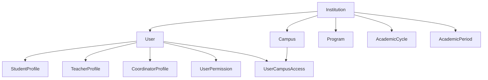
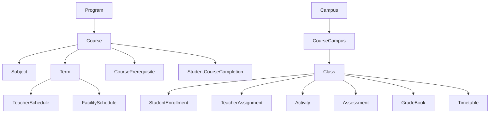
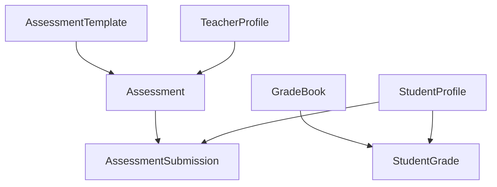
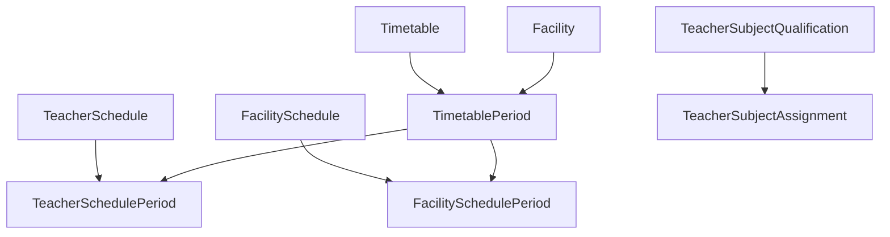
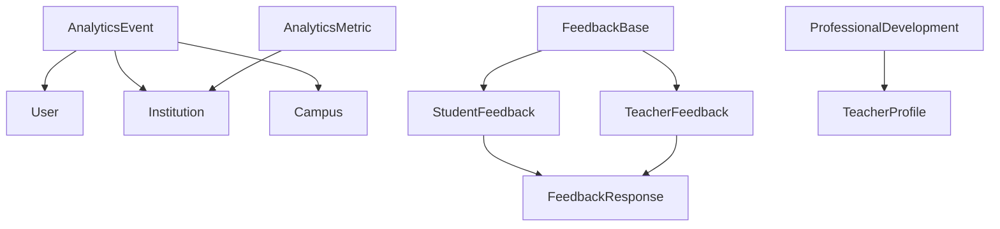
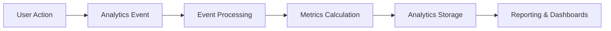
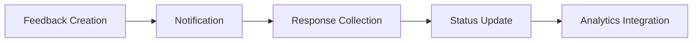
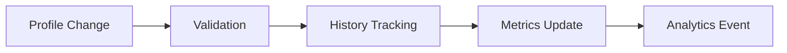

# Modern System Architecture (Next.js 14+ + tRPC)

## Project Structure

```
/src
├── app                      # Next.js App Router
│   ├── (auth)              # Authentication Routes
│   │   ├── login
│   │   ├── register
│   │   └── forgot-password
│   ├── (system-admin)      # System Admin Portal
│   │   ├── dashboard
│   │   ├── campuses
│   │   ├── programs
│   │   └── settings
│   ├── (campus-admin)      # Campus Admin Portal
│   │   ├── dashboard
│   │   ├── teachers
│   │   ├── students
│   │   └── facilities
│   ├── (coordinator)       # Coordinator Portal
│   │   ├── dashboard
│   │   ├── programs
│   │   ├── classes
│   │   └── reports
│   ├── (teacher)           # Teacher Portal
│   │   ├── dashboard
│   │   ├── schedule
│   │   ├── classes
│   │   └── assessments
│   ├── (student)           # Student Portal
│   │   ├── dashboard
│   │   ├── schedule
│   │   ├── courses
│   │   └── assessments
│   ├── api                 # API Routes
│   │   ├── trpc           # tRPC Handler
│   │   └── webhooks       # External Service Webhooks
│   └── error.tsx          # Global Error Boundary
│
├── components              # React Components
│   ├── ui                 # shadcn/ui Base Components
│   │   ├── button
│   │   ├── calendar
│   │   └── data-table
│   ├── forms              # Form Components
│   │   ├── auth
│   │   ├── academic
│   │   └── calendar
│   ├── layouts            # Layout Components
│   │   ├── system-admin
│   │   ├── campus-admin
│   │   ├── coordinator
│   │   ├── teacher
│   │   └── student
│   └── shared             # Shared Components
│       ├── navigation
│       ├── calendar
│       └── data-display
│
├── server                 # Backend Logic
│   ├── api               # tRPC API Definition
│   │   ├── root.ts      # Root Router
│   │   ├── middleware   # API Middleware
│   │   │   ├── auth.ts
│   │   │   └── logging.ts
│   │   └── routers      # Feature Routers
│   │       ├── auth.ts
│   │       ├── system-admin.ts
│   │       ├── campus-admin.ts
│   │       ├── coordinator.ts
│   │       ├── teacher.ts
│   │       └── student.ts
│   ├── db               # Database Layer
│   │   ├── schema.prisma
│   │   └── migrations
│   └── services         # Business Logic
│       ├── auth
│       ├── academic
│       ├── calendar
│       └── notifications
│
├── lib                  # Shared Utilities
│   ├── hooks           # Custom Hooks
│   │   ├── auth
│   │   ├── forms
│   │   └── queries
│   ├── utils           # Helper Functions
│   │   ├── api
│   │   ├── date
│   │   ├── validation
│   │   └── analytics
│   └── config          # Configuration
│       ├── auth
│       ├── navigation
│       ├── constants
│       └── feature-flags
│
├── types               # TypeScript Types
│   ├── auth.ts
│   ├── academic.ts
│   ├── api.ts
│   └── analytics.ts
│
└── styles             # Global Styles
    ├── globals.css
    └── themes.css

/prisma                # Prisma Configuration
├── schema.prisma      # Database Schema
├── migrations        # Database Migrations
├── seed.ts          # Seed Data
└── types           # Generated Prisma Types

/public              # Static Assets
├── images
├── icons
└── fonts

/tests              # Testing Directory
├── unit           # Unit Tests
├── integration    # Integration Tests
└── e2e           # End-to-End Tests
```

## Key Technologies

### 1. Frontend Framework
- **Next.js 15+** with App Router
- **React Server Components** for optimal performance
- **Server Actions** for form handling
- **Streaming** and **Suspense** for loading states
- **Progressive Enhancement**
- **Edge Runtime** support

### 2. API Layer
- **tRPC v11** for end-to-end type safety
- **Procedures** organized by domain
- **Input validation** with Zod
- **Error handling** middleware
- **Rate limiting** and **caching**
- **OpenAPI** documentation

### 3. Authentication & Security
- **Custom auth Implimentation** 
- **Role-based access control** (RBAC)
- **Campus-specific permissions**
- **Session management**
- **CSRF protection**
- **Content Security Policy**

### 4. Database & Caching
- **Prisma ORM** with PostgreSQL
- **Connection pooling**
- **Type-safe queries**
- **Automated migrations**
- **Redis** for caching optional
- **Database replication**

### 5. UI Components
- **shadcn/ui** component library
- **Tailwind CSS** for styling
- **Radix UI** primitives
- **Custom theme system**
- **Dark mode** support
- **Responsive design**

### 6. Performance & Monitoring
- **Real User Monitoring** (RUM)
- **Error tracking**
- **Analytics integration**
- **Performance metrics**
- **Logging system**
- **Health checks**

## Data Models & Relationships

### 1. Core Identity Models


### 2. Academic Structure


### 3. Assessment & Grading System


### 4. Scheduling & Facilities


### 5. Analytics & Feedback System


## Enhanced Features

### 1. Academic Management
- **Program Structure**
  ```typescript
  {
    code: string,
    name: string,
    type: string,
    level: number,
    duration: number,
    settings: Json,
    curriculum: Json
  }
  ```
- **Course Management**
  ```typescript
  {
    code: string,
    name: string,
    description: string,
    level: number,
    credits: number,
    settings: Json,
    syllabus: Json,
    prerequisites: CoursePrerequisite[]
  }
  ```
- **Class Operations**
  ```typescript
  {
    code: string,
    name: string,
    minCapacity: number,
    maxCapacity: number,
    currentCount: number,
    students: StudentEnrollment[],
    teachers: TeacherAssignment[],
    activities: Activity[],
    assessments: Assessment[],
    timetables: Timetable[]
  }
  ```

### 2. Assessment System
- **Templates**
  ```typescript
  {
    category: AssessmentCategory,
    gradingType: GradingType,
    gradingScale: GradingScale,
    maxScore: number,
    passingScore: number,
    weightage: number,
    gradingConfig: Json,
    rubric: Json,
    autoGradingRules: Json
  }
  ```
- **Submissions**
  ```typescript
  {
    content: Json,
    attachments: Json,
    score: number,
    grade: string,
    status: SubmissionStatus,
    gradingDetails: Json,
    feedback: Json,
    comments: string
  }
  ```

### 3. Scheduling System
- **Teacher Schedule**
  ```typescript
  {
    teacherId: string,
    termId: string,
    periods: TeacherSchedulePeriod[],
    startDate: DateTime,
    endDate: DateTime
  }
  ```
- **Facility Schedule**
  ```typescript
  {
    facilityId: string,
    termId: string,
    periods: FacilitySchedulePeriod[],
    startDate: DateTime,
    endDate: DateTime
  }
  ```

### 4. Analytics System
- **Event Tracking**
  ```typescript
  {
    eventType: AnalyticsEventType,
    metadata: Json,
    sessionId: string,
    deviceInfo: Json,
    timestamp: DateTime
  }
  ```
- **Metrics Collection**
  ```typescript
  {
    name: string,
    value: number,
    dimensions: Json,
    tags: Json,
    timestamp: DateTime
  }
  ```

### 5. Feedback System
- **Base Feedback**
  ```typescript
  {
    type: FeedbackType,
    severity: FeedbackSeverity,
    title: string,
    description: string,
    tags: string[],
    attachments: Json,
    status: SystemStatus
  }
  ```
- **Responses**
  ```typescript
  {
    content: string,
    attachments: Json,
    status: SystemStatus
  }
  ```

## Data Flow Architecture

### 1. Analytics Flow


### 2. Feedback Flow


### 3. Profile Updates Flow


## Security & Privacy

### 1. Data Protection
- Encrypted sensitive data
- Role-based access control
- Campus-specific permissions
- Audit logging

### 2. Privacy Controls
- Data retention policies
- Access restrictions
- Consent management
- Data anonymization

## Performance Optimization

### 1. Database Optimization
- Efficient indexing strategy
- Query performance monitoring
- Data partitioning
- Caching layers

### 2. Analytics Performance
- Event batching
- Async processing
- Data aggregation
- Metric caching

## Monitoring & Maintenance

### 1. System Health
- Performance metrics
- Error tracking
- Resource utilization
- Security alerts

### 2. Academic Analytics
- Student performance
- Teacher effectiveness
- Course success rates
- Attendance patterns

## Development Guidelines

### 1. Code Organization
- **Feature-first** architecture
- **Domain-driven** design principles
- **Clean architecture** patterns
- **SOLID** principles adherence
- **Atomic design** for components
- **Type-safety** across layers

### 2. Performance Optimization
- **Bundle size** optimization
- **Code splitting** strategies
- **Image optimization**
- **Caching** strategies
- **Lazy loading**
- **Performance budgets**

### 3. Testing Strategy
- **Unit tests** for business logic
- **Integration tests** for API
- **E2E tests** for critical flows
- **Component tests**
- **Visual regression** tests
- **Performance** tests

### 4. State Management
- **Server state** with React Query
- **Local state** with React hooks
- **Form state** with React Hook Form
- **Global state** with Zustand
- **Persistent state** handling
- **Real-time** updates

### 5. Security Measures
- **Input validation**
- **Output sanitization**
- **Rate limiting**
- **CORS policies**
- **Security headers**
- **Audit logging**

## Environment Configuration
```env
# .env
DATABASE_URL="postgresql://..."
REDIS_URL="redis://..."
NEXTAUTH_SECRET="..."
NEXTAUTH_URL="http://localhost:3000"
NEXT_PUBLIC_APP_URL="http://localhost:3000"
NEXT_PUBLIC_API_URL="http://localhost:3000/api"
NEXT_PUBLIC_WS_URL="ws://localhost:3000"
ANALYTICS_KEY="..."
SENTRY_DSN="..."
FEATURE_FLAGS="..."

# Analytics Configuration
ANALYTICS_BATCH_SIZE=100
ANALYTICS_RETENTION_DAYS=365
ANALYTICS_SAMPLING_RATE=1.0

# Feedback Configuration
FEEDBACK_NOTIFICATION_ENABLED=true
FEEDBACK_RESPONSE_TIMEOUT=72h

# Profile Configuration
PROFILE_IMAGE_STORAGE=s3
PROFILE_BACKUP_ENABLED=true
```

## Deployment & CI/CD

### 1. Infrastructure
- **Vercel** for frontend
- **PostgreSQL** on managed service
- **Redis** for caching
- **S3** for file storage
- **CDN** for assets
- **Monitoring** tools

### 2. CI/CD Pipeline
- **GitHub Actions**
- **Automated testing**
- **Code quality** checks
- **Security scanning**
- **Performance testing**
- **Automated deployment**

### 3. Monitoring & Alerts
- **Error tracking**
- **Performance monitoring**
- **Usage analytics**
- **Health checks**
- **Alert systems**
- **Logging infrastructure**

## API Structure (tRPC)

```typescript
// Enhanced router configuration
export const createBaseRouter = <TContext>() => ({
  middleware: [
    errorHandler,
    rateLimiter,
    analytics,
    auditLogger,
    privacyFilter
  ],
  formatError: customErrorFormatter,
});

// Analytics router
export const analyticsRouter = createTRPCRouter({
  events: eventRouter,
  metrics: metricRouter,
  reports: reportRouter,
  dashboards: dashboardRouter
});

// Feedback router
export const feedbackRouter = createTRPCRouter({
  student: studentFeedbackRouter,
  teacher: teacherFeedbackRouter,
  responses: responseRouter,
  notifications: notificationRouter
});

// Profile router
export const profileRouter = createTRPCRouter({
  student: studentProfileRouter,
  teacher: teacherProfileRouter,
  coordinator: coordinatorProfileRouter,
  development: professionalDevelopmentRouter
});
``` 